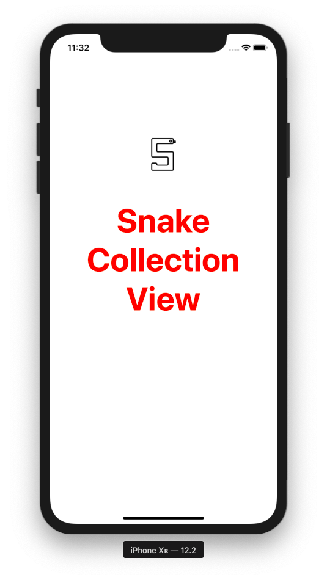
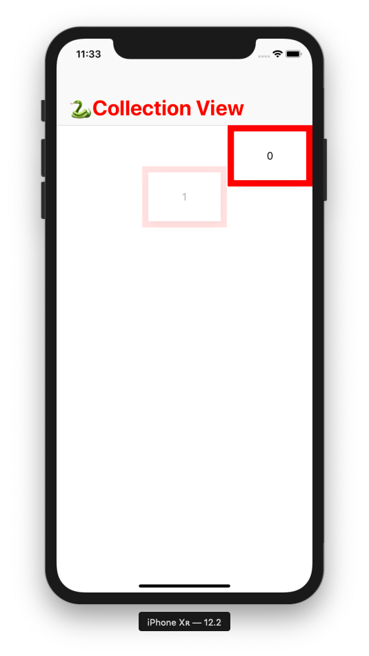
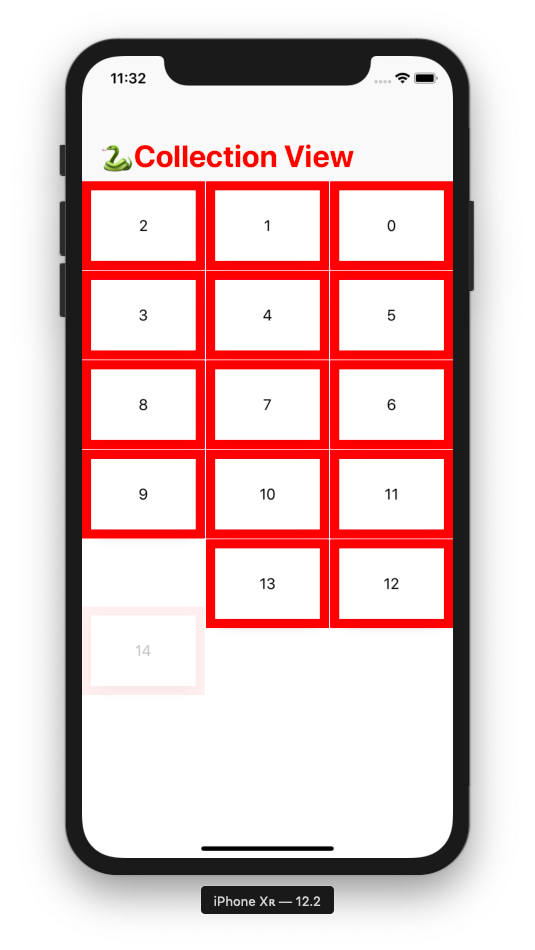
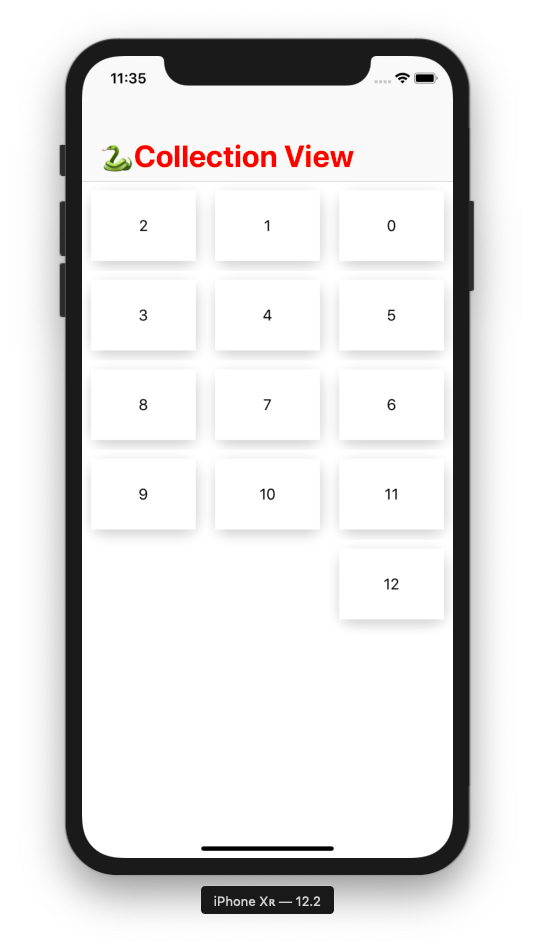

# 🐍 Snake Collection View 🐍
iOS app showing cell in UICollectionView as snake like layout. We can use this layout to present timeline, tracking system, showcase, portfolio, etc.

My purpose of making this project on github is to enable more possibile uses of this layout. I would like to know If you know where we can use this layout. I would be happy if you suggest features/fucntionalities which can be added to this layout. 

<p align="center">
  
  
  
  

</p>


### :octocat: Prerequisite:
1. :gem: [Youtube Video : https://youtu.be/zGqv--Womzg](https://youtu.be/zGqv--Womzg)

### :octocat: How to run and test this app:
1. :gem: Download this repo or clone it using ```'git clone https://github.com/nikhilgohil11/SnakeCollectionView.git'``` 💻
1. :gem: Now open ```'SnakeCollectionView.xcodeproj'``` in Xcode and hit run.


## :

Uses 
:------------: | :-------------:
Travel History | Show Portfolio 
Tracking View | Show Timeline
Organisation's position | Project progress


